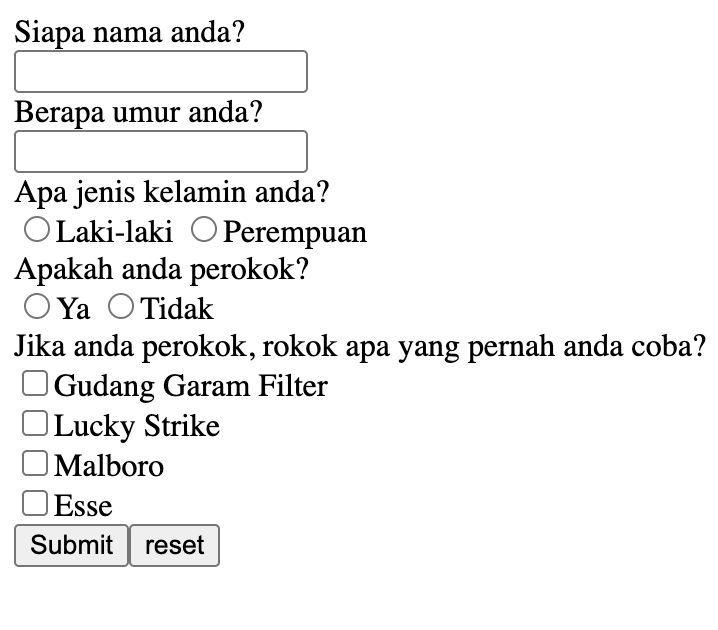

# Input
Membuat sebuat input dengan beberapa type seperti type teks, type radio, type checkbox, dan type submit. Nah yang bikin unik nya , saya di sini membuat denggan menggunakan Emmet yang dimna pengetikan struktur kode nya dengan satu garis saja misal:

    <!-- div>form>label{Siapa nama anda?}+input -->

Maka jika di enter akan muncul seperti ini:

    

        <form action=""><label>Siapa nama anda?</label> 
        <input type="text">
        </form>
     

# Hasil
